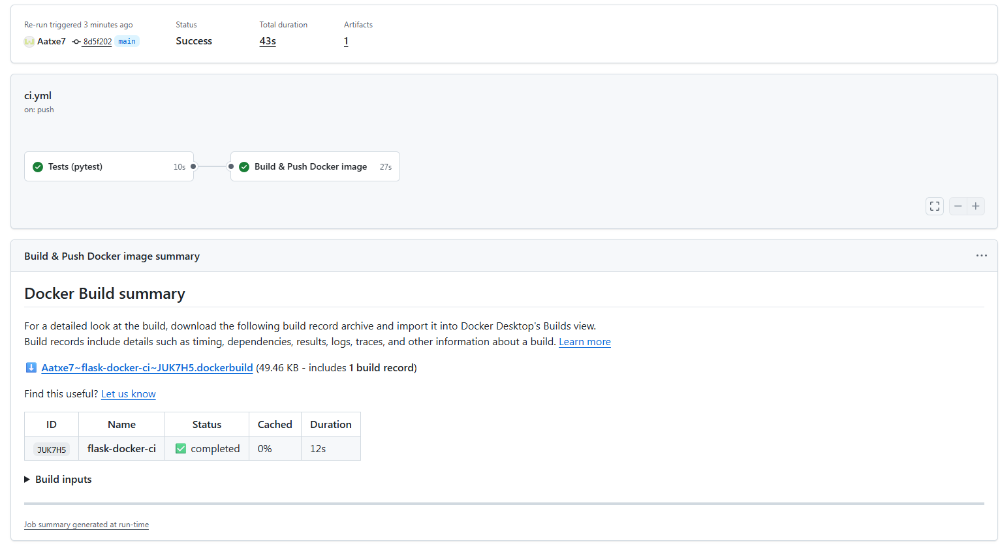
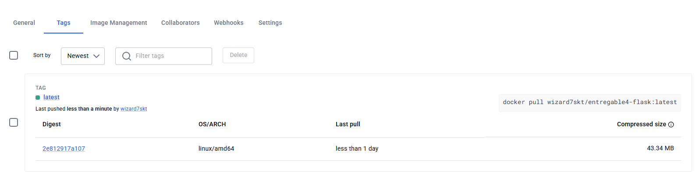
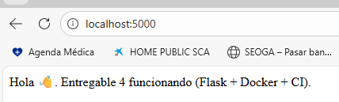

# Entregable 4 — Flask + Docker + CI (GitHub Actions)

## 1. Objetivo del proyecto

Este repositorio implementa una aplicación web mínima en **Flask** que responde en la ruta raíz (`/`) con un mensaje de saludo y la entrega se completa con:

- **Contenerización con Docker** (Dockerfile + requirements).
- **Pipeline CI con GitHub Actions**:
  - descarga el código,
  - ejecuta **tests (pytest)**,
  - construye la imagen Docker,
  - y **publica la imagen en Docker Hub**.

> La estructura y requisitos están alineados con el enunciado del “Entregable 4”.  

---

## 2. Requisitos previos

### 2.1 En local
- Git instalado
- Python 3.12+ (recomendado)
- Docker Desktop (Windows/Mac) o Docker Engine (Linux)

### 2.2 En la nube
- Cuenta de GitHub
- Cuenta de Docker Hub (y un repositorio creado para la imagen)

---

## 3. Estructura del proyecto

```
.
├─ app.py
├─ requirements.txt
├─ requirements-dev.txt
├─ Dockerfile
├─ .dockerignore
├─ .gitignore
├─ tests/
│  └─ test_app.py
└─ .github/
   └─ workflows/
      └─ ci.yml
```

---

## 4. Cómo ejecutar en local (sin Docker)

### 4.1 Crear entorno virtual e instalar dependencias

```bash
python -m venv .venv
# Windows:
.venv\Scripts\activate
# Linux/Mac:
# source .venv/bin/activate

python -m pip install --upgrade pip
pip install -r requirements-dev.txt
```

### 4.2 Ejecutar la app

```bash
python app.py
```

Abre en el navegador:
- http://localhost:5000/

Deberías ver el mensaje de saludo en texto plano.

### 4.3 Ejecutar tests

```bash
pytest -q
```

---

## 5. Cómo ejecutar con Docker (local)

### 5.1 Build de la imagen

> Sustituye `TU_USUARIO_DOCKERHUB` por tu usuario.

```bash
docker build -t TU_USUARIO_DOCKERHUB/entregable4-flask:local .
```

### 5.2 Arrancar el contenedor

```bash
docker run --rm -p 5000:5000 TU_USUARIO_DOCKERHUB/entregable4-flask:local
```

Verifica en:
- http://localhost:5000/

---

## 6. Publicación en Docker Hub (desde GitHub Actions)

### 6.1 Crear repositorio en Docker Hub
En Docker Hub crea un repositorio llamado por ejemplo:

- `entregable4-flask`

La ruta final de la imagen será:
- `docker.io/TU_USUARIO_DOCKERHUB/entregable4-flask`

### 6.2 Crear token en Docker Hub (recomendado)
En Docker Hub genera un **Access Token** (en lugar de usar la contraseña).

### 6.3 Configurar Secrets en GitHub
En tu repo de GitHub:
- **Settings → Secrets and variables → Actions → New repository secret**

Crea estos secrets:
- `DOCKERHUB_USERNAME` = tu usuario de Docker Hub
- `DOCKERHUB_TOKEN` = tu token de Docker Hub

> Nota: en el workflow se usa `secrets.DOCKERHUB_USERNAME` también como parte del nombre de la imagen.

---

## 7. Pipeline CI (GitHub Actions)

El workflow está en:

- `.github/workflows/ci.yml`

### 7.1 Qué hace el pipeline

1) **Job `test`**  
   - Checkout del repo  
   - Setup de Python  
   - Instala dependencias de desarrollo  
   - Ejecuta `pytest`

2) **Job `docker`** (depende de `test`)  
   - Checkout del repo  
   - Setup Buildx (y QEMU opcional)  
   - Genera tags (latest + sha)  
   - Login en Docker Hub (solo en `push` a main)  
   - Build y Push de la imagen a Docker Hub

### 7.2 Cuándo se ejecuta
- En **Pull Request**: ejecuta tests y build (sin push).
- En **push a `main`**: ejecuta tests, build y **push**.

---

## 8. Verificación de la imagen publicada

Tras un push a `main`, verifica que existe:

- `docker.io/TU_USUARIO_DOCKERHUB/entregable4-flask:latest`
- `docker.io/TU_USUARIO_DOCKERHUB/entregable4-flask:sha-...`

Prueba desde cualquier máquina con Docker:

```bash
docker pull TU_USUARIO_DOCKERHUB/entregable4-flask:latest
docker run --rm -p 5000:5000 TU_USUARIO_DOCKERHUB/entregable4-flask:latest
```

Y abre:
- http://localhost:5000/

---

## 9. Evidencias recomendadas (para máxima nota)

- Captura del pipeline en verde (tests + build + push).
- Captura de Docker Hub con la imagen y tags.
- `README.md` con instrucciones claras (este documento).
- Opcional: añadir badge de GitHub Actions y badge de Docker pulls.

---

## 10. Troubleshooting rápido

- **Puerto ocupado**: cambia el mapeo `-p 5001:5000` y prueba en `http://localhost:5001/`.
- **Login fallido**: revisa `DOCKERHUB_USERNAME` y `DOCKERHUB_TOKEN`.
- **403/denied al push**: asegúrate de que el repo existe en Docker Hub y el token tiene permisos.

---

## 11. Licencia

Proyecto educativo para el Entregable 4.


## 12. Evidencias:

 
 

